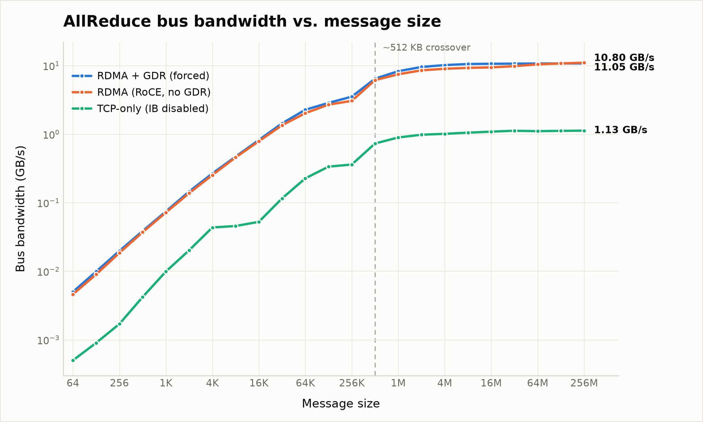

# NCCL Multinode Characterization

Characterizing NCCL collective communication across a heterogeneous 2-node GPU cluster (TCP/Ethernet, with a GPUDirect RDMA upgrade path).

## Contents

- [Baseline Performance](#baseline-performance)
- [GPU-NIC NUMA Topology](#gpu-nic-numa-topology)
- [NCCL All-Reduce Benchmark](#nccl-all-reduce-benchmark-gpudirect-rdma-over-roce)
- [Latency-Bound vs. Bandwidth-Bound: The Crossover](#latency-bound-vs-bandwidth-bound-the-crossover)

## Baseline Performance

| Metric | Value | Method |
|---|---|---|
| Network bandwidth | 942 Mbps (TCP/Ethernet) | `iperf3` |

## GPU-NIC NUMA Topology

- `lscpu` → check `Socket(s):` for the number of CPU sockets/NUMA nodes.
- `lspci -tv` → check whether the GPU and NIC share a PCIe root complex.

Example (trimmed):

```
-[0000:00]-+-02.0-[01]----00.0  Mellanox ConnectX-5   <- NIC
           \-1d.0-[3d]----00.0  NVIDIA A100            <- GPU
```

`-[0000:00]-` is the root complex; both the NIC (bus `01`) and GPU (bus `3d`) branch from it, so they sit on the same root complex/NUMA node. A device under a different root (e.g. `-[0000:80]-`) would require a cross-socket hop.

PCIe address format is `domain:bus:device.function` (e.g. `0000:3d:00.0`); the `bus` field is what you trace up through the `lspci -tv` tree to find its root complex.

## NCCL All-Reduce Benchmark (GPUDirect RDMA over RoCE)

`all_reduce_perf` from [nccl-tests](https://github.com/NVIDIA/nccl-tests) was run across the 2 nodes (1 GPU per node) via `mpirun`:

```
mpirun -np 2 --hostfile <hostfile> \
  --mca btl_tcp_if_include <net_interface> \
  -x LD_LIBRARY_PATH=<path_to_nccl_build>/lib:$LD_LIBRARY_PATH \
  -x NCCL_DEBUG=INFO \
  -x NCCL_SOCKET_IFNAME=<net_interface> \
  <path_to_nccl_tests>/build/all_reduce_perf -b 8M -e 128M -f 2 -g 1
```

### Parameters

| Flag | Meaning |
|---|---|
| `-np 2` | Number of MPI processes to launch — one rank per node here |
| `--hostfile` | File listing the participating hosts for MPI to launch ranks on |
| `--mca btl_tcp_if_include <iface>` | Restricts OpenMPI's TCP transport (MPI's own out-of-band control messages) to a specific NIC |
| `-x VAR=val` | Exports an environment variable to all remote MPI ranks |
| `NCCL_DEBUG=INFO` | Enables verbose NCCL logging (topology detection, transport selection, init timings, etc.) |
| `NCCL_SOCKET_IFNAME` | NIC NCCL uses for its socket-based bootstrap/rendezvous handshake (the data plane may still use a different transport, e.g. RDMA) |
| `-b 8M` | Starting message size for the sweep (8 MiB) |
| `-e 128M` | Ending message size for the sweep (128 MiB) |
| `-f 2` | Step multiplication factor — message size doubles each step |
| `-g 1` | Number of GPUs used per MPI process/thread |

The `NCCL_DEBUG=INFO` log confirms the data path used RDMA rather than plain TCP sockets: the bootstrap/handshake went over the socket interface, but the collective traffic itself was assigned to `NET/IB` using `mlx5_0:1/RoCE` — i.e. GPUDirect RDMA over RoCE, the upgrade path this repo characterizes, distinct from the plain TCP/Ethernet baseline above.

### Results

| Size | Count | Type | Time (us) | AlgBW (GB/s) | BusBW (GB/s) | Wrong |
|---|---|---|---|---|---|---|
| 8 MiB | 2,097,152 | float | 906.10 | 9.26 | 9.26 | 0 |
| 16 MiB | 4,194,304 | float | 1783.01 | 9.41 | 9.41 | 0 |
| 32 MiB | 8,388,608 | float | 3417.71 | 9.82 | 9.82 | 0 |
| 64 MiB | 16,777,216 | float | 6509.84 | 10.31 | 10.31 | 0 |
| 128 MiB | 33,554,432 | float | 12412.5 | 10.81 | 10.81 | 0 |

**Average bus bandwidth:** 9.92 GB/s (out-of-place run; reduction operation `sum`, root `-1`)

<details>
<summary>Raw output</summary>

```
                                                             out-of-place                       in-place
      size         count      type   redop    root     time   algbw   busbw  #wrong     time   algbw   busbw  #wrong
       (B)    (elements)                               (us)  (GB/s)  (GB/s)             (us)  (GB/s)  (GB/s)
    8388608       2097152     float     sum      -1   906.10    9.26    9.26       0   904.42    9.28    9.28       0
   16777216       4194304     float     sum      -1  1783.01    9.41    9.41       0  1783.59    9.41    9.41       0
   33554432       8388608     float     sum      -1  3417.71    9.82    9.82       0  3401.17    9.87    9.87       0
   67108864      16777216     float     sum      -1  6509.84   10.31   10.31       0  6476.94   10.36   10.36       0
  134217728      33554432     float     sum      -1  12412.5   10.81   10.81       0  12566.5   10.68   10.68       0
Avg bus bandwidth    : 9.91961 GB/s
```

</details>

### Output columns

| Column | Meaning |
|---|---|
| `size (B)` / `count (elements)` | Message size in bytes, and in number of elements of `type` |
| `type` | Data type reduced (`float` here) |
| `redop` | Reduction operation applied (`sum`) |
| `root` | Root rank for rooted collectives (`-1` — not applicable to all-reduce; every rank receives the result) |
| `time (us)` | Wall-clock time for the collective call |
| `algbw (GB/s)` | Algorithm bandwidth — `size / time`, the throughput of the collective call as invoked |
| `busbw (GB/s)` | Bus bandwidth — `algbw` scaled by a collective-specific correction factor so it reflects actual data volume moved across the link, making it comparable to the NIC's physical link rate regardless of algorithm or GPU count. For ring all-reduce the factor is `2*(n-1)/n`; with `n = 2` nodes that factor is `1`, so `algbw` and `busbw` are equal in every row above |
| `#wrong` | Mismatches found when validating the reduction result against an expected value (`0` = correct), reported separately for the out-of-place and in-place runs |

### Interpretation

- **Achieved:** ~9.92 GB/s average bus bandwidth (~79.4 Gbit/s), rising from 9.26 GB/s at 8 MiB to 10.81 GB/s at 128 MiB as larger messages amortize fixed overhead.
- This reflects GPUDirect RDMA throughput over RoCE, not the plain TCP/Ethernet baseline (942 Mbps). `busbw` is the metric to compare against the NIC's rated link speed to assess how close the measured throughput is to line rate.

## Latency-Bound vs. Bandwidth-Bound: The Crossover

Sweeping `all_reduce_perf` from 64 B up to 256 MiB across three transports — RDMA + GDR, RDMA over RoCE without GDR, and TCP-only (IB disabled) — surfaces a crossover point at which the dominant cost of a collective call flips from fixed per-message overhead to raw data volume:



This is the standard way interconnects are characterized in HPC — the Hockney α-β model, where time for a message of size `n` is `T(n) = α + n/β` (`α` = fixed per-message latency, `β` = achievable bandwidth). The crossover, sometimes called the *n½ point*, is where the two terms contribute equally. Quoting "peak bandwidth" alone hides this: it says nothing about whether that peak is reachable at the message sizes a real workload actually sends.

| Regime | What dominates | What helps | What doesn't |
|---|---|---|---|
| **Below crossover** (latency-bound) | Fixed per-message overhead `α` | Fewer/bigger messages (batching, gradient fusion, bucketing); cutting overhead itself (GDR to skip the host-copy hop, fewer hops, a leaner protocol) | More bandwidth — you're paying the same `α` per message regardless of link speed |
| **Above crossover** (bandwidth-bound) | Data volume, `size / β` | A bigger pipe — faster NIC, RDMA over TCP, more channels/rings in parallel | Further reducing `α` — it's already negligible next to transfer time |

In the data above, this shows up two ways:

- **GDR's edge over plain RDMA is a below-crossover story.** Both curves converge to the same ~11 GB/s ceiling above ~512 KB — once bandwidth-bound, skipping the host-copy hop barely moves the needle. Below the crossover, every microsecond of `α` counts, so GDR's overhead reduction would matter more precisely where this sweep shows the two curves closest together in absolute terms but furthest apart relative to the (tiny) total time.
- **RDMA's ~10× advantage over TCP-only is an above-crossover story.** Below the crossover both transports are latency-dominated and their gap is comparatively small; above it, bandwidth is the whole story and TCP-only's much lower `β` ceiling (~1.13 GB/s vs. ~11 GB/s) becomes the dominant fact.

### Practical payoff

The crossover says where to spend tuning effort, given the message sizes a workload actually sends:

- **Small, frequent AllReduce calls** (small gradient tensors, many sync points) sit below crossover — the win comes from bucketing/fusing gradients into larger messages (e.g. tuning PyTorch DDP's `bucket_cap_mb`) or cutting protocol overhead, not from a faster NIC.
- **Large fused gradient buffers or big collective ops** (checkpointing, activation exchange) sit above crossover — here RDMA's bandwidth advantage is worth every bit of setup effort, and TCP-only would genuinely cripple throughput.
 NIC's rated link speed to gauge how close the achieved throughput is to line rate
